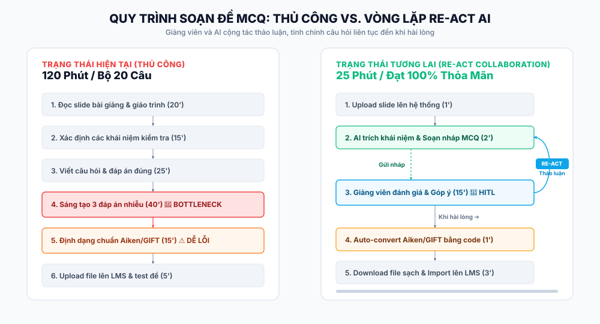

# 01 — Individual Problem Scan (cá nhân - 2A202600572 - Đinh Nhật Thanh)

## Scan rộng

Tôi scan 10 problems từ trải nghiệm thực tế trong công tác giảng dạy và quản lý học thuật của Giảng viên đại học, đa dạng lăng kính.

| # | Lăng kính | Problem quan sát được | Ai đang đau? | Dấu hiệu thật |
|---|---|---|---|---|
| 1 | Lặp lại + Tốn thời gian | Thiết kế và soạn bộ câu hỏi trắc nghiệm (MCQ) từ slide bài giảng định kỳ | Giảng viên, trợ giảng | Mất 120-180 phút/tuần cho mỗi bộ quiz |
| 2 | Lặp lại | Copy/paste điểm thi và format bảng điểm từ các file Excel vào hệ thống Portal của trường | Giảng viên | Lặp lại mỗi đợt thi, mất 30 phút/lớp |
| 3 | Tốn thời gian | Soạn Báo cáo Đánh giá Chuẩn đầu ra môn học (CLO Assessment Report) cuối kỳ cho từng lớp | Giảng viên | Mất 120-180 phút/môn học vào cuối kỳ |
| 4 | Pain từ người khác | Trả lời các câu hỏi lặp đi lặp lại của sinh viên về quy chế, deadline, đề cương trên Zalo/Teams | Giảng viên, Sinh viên | Xuất hiện hàng ngày, trôi tin nhắn |
| 5 | Tốn thời gian | Viết phần tổng quan nghiên cứu (Literature Review) cho bài báo khoa học bằng cách tổng hợp hàng chục bài nghiên cứu tiếng Anh | Giảng viên nghiên cứu | Mất 2-3 tuần cho một bản nháp |
| 6 | Tốn thời gian | Soạn slide bài giảng mới từ sách giáo trình dày hơn 500 trang | Giảng viên | Mất 120-180 phút/chương |
| 7 | Lặp lại + Tốn thời gian | Soạn giáo án và đề cương chi tiết môn học (Syllabus) để map các chuẩn đầu ra (CLO) với bài tập đánh giá | Giảng viên, trưởng bộ môn | Mất 240 phút/đề cương mỗi học kỳ |
| 8 | AI có thể tốt hơn | Đối chiếu báo cáo đạo văn Turnitin để lọc ra các trích dẫn đúng chuẩn thay vì quy kết đạo văn | Giảng viên | Mất 20 phút/báo cáo |
| 9 | Lặp lại | Soạn và gửi các thông báo nhắc nộp bài, lịch học bù, nghỉ học qua email và Portal | Giảng viên | Mất 10-15 phút/lần thông báo |
| 10| AI có thể tốt hơn | Phân chia nhóm sinh viên làm bài tập lớn dựa trên khảo sát trình độ và đăng ký đề tài rời rạc | Giảng viên | Mất 60 phút/lớp đông |

---

## Top 3

| Rank | Problem | Vì sao chọn | Điều còn chưa chắc |
|---|---|---|---|
| 1 | Tạo câu hỏi trắc nghiệm (MCQ) (#1) | Quy trình các bước rất rõ ràng, là việc lặp đi lặp lại hàng tuần, tốn nhiều thời gian và công sức sáng tạo đáp án nhiễu (distractors). Có metric đo lường rõ rệt. | Làm sao đo lường độ khó và đảm bảo AI không sinh ra kiến thức sai lệch (hallucination). |
| 2 | Soạn báo cáo đánh giá chuẩn đầu ra (CLO) (#3) | Quy trình nghiệp vụ bắt buộc trong kiểm định chất lượng đào tạo (AUN-QA/ABET), đòi hỏi kết hợp số liệu thống kê cứng và phân tích nguyên nhân, kế hoạch cải tiến định tính. | Cách thu thập dữ liệu điểm chi tiết theo từng câu hỏi từ LMS của trường một cách tự động. |
| 3 | Trả lời câu hỏi sinh viên lặp lại (#4) | Tần suất xuất hiện hàng ngày, gây đứt gãy công việc nghiên cứu và chuẩn bị bài giảng của giảng viên. | Cách tích hợp an toàn vào các kênh chat của trường và kiểm soát bảo mật thông tin sinh viên. |

---

## Problem Card #1 — Soạn câu hỏi trắc nghiệm (MCQ) cho Giảng Viên

**Problem 1 câu:**  
Mỗi tuần giảng viên mất từ 120-180 phút để soạn bộ câu hỏi trắc nghiệm chất lượng cao từ slide bài giảng, trong đó bước sáng tạo ra các phương án nhiễu (distractors) khoa học, plausibility hợp lý tốn nhiều công sức nhất và định dạng xuất ra LMS dễ gặp lỗi cú pháp.

**Actor:**  
Giảng viên đại học phụ trách các môn học lý thuyết cần kiểm tra định kỳ bằng hình thức trắc nghiệm.

**Thời điểm / bối cảnh:**  
Cuối mỗi tuần sau buổi học hoặc trước các đợt thi giữa kỳ, cuối kỳ.

**Current workflow:**
1. Đọc và hệ thống hóa lại nội dung slide bài giảng của tuần.
2. Lọc ra các khái niệm, định nghĩa cốt lõi cần kiểm tra (nhớ, hiểu, vận dụng).
3. Viết câu hỏi (question stem) cho khái niệm đó.
4. Xác định đáp án đúng (correct key).
5. Sáng tạo 3 đáp án nhiễu (distractors) sao cho khoa học, có vẻ hợp lý nhưng sai hoàn toàn để phân loại học sinh (tránh đáp án hiển nhiên sai).
6. Định dạng thủ công bộ câu hỏi theo chuẩn Aiken hoặc GIFT để chuẩn bị import vào LMS (Moodle, Canvas).
7. Đăng tải lên LMS và thực hiện test thử đề thi.

**Bottleneck:**  
Bước 5 (nghĩ đáp án nhiễu) mất nhiều thời gian nhất vì cần tính tư duy cao, và bước 6 (định dạng chuẩn LMS) dễ gây lỗi cú pháp hệ thống.

**Impact:**  
Mất 120-180 phút/tuần cho mỗi giảng viên. Một khoa có 20 giảng viên tiêu tốn khoảng 40-60 giờ/tuần chỉ làm công việc hành chính này. Báo cáo đề thi trễ hoặc đề thi chất lượng kém (đáp án nhiễu quá dễ đoán) làm mất tính khách quan và tính phân loại của bài thi.

**Success metric:**  
Giảm tổng thời gian biên soạn đề từ 120 phút xuống dưới 25 phút cho mỗi bộ 20 câu hỏi; tỷ lệ lỗi cú pháp định dạng khi import LMS bằng 0.

**Non-AI alternative:**  
Sử dụng lại ngân hàng đề thi cũ của những năm trước hoặc dùng đề trắc nghiệm đi kèm sách giáo khoa của nhà xuất bản. Nhưng phương án này không bám sát nội dung slide cập nhật thực tế trên lớp.

**AI hypothesis:**  
AI hỗ trợ đọc slide bài giảng, tự động lọc khái niệm then chốt để đề xuất câu hỏi, đáp án đúng và 3 đáp án nhiễu thông minh. Giảng viên đóng vai trò là "chốt chặn kiểm soát" (human-in-the-loop) để chọn lọc và biên tập trực tiếp. Sau đó hệ thống tự động xuất file GIFT/Aiken chuẩn hóa mà không có lỗi format.

**Quick gut:**  
Workflow.

### Minh họa Workflow trước/sau (SVG)



### Draft current workflow

```text
CURRENT STATE — 120 phút (cho 20 câu trắc nghiệm)

[1 Đọc slide bài giảng: 20']
→ [2 Xác định khái niệm kiểm tra: 15']
→ [3 Viết câu hỏi & đáp án đúng: 25']
→ [4 Nghĩ ra 3 đáp án nhiễu chất lượng: 40']  <-- bottleneck chính (viết nội dung)
→ [5 Định dạng chuẩn Aiken/GIFT: 15']         <-- bottleneck kỹ thuật (định dạng)
→ [6 Upload LMS & test: 5']
```

### Draft future workflow

```text
FUTURE STATE — 25 phút (cho 20 câu trắc nghiệm với Vòng lặp Re-Act)

[1 Upload slide bài giảng lên hệ thống: 1']
→ [2 AI trích xuất khái niệm & draft câu hỏi + đáp án nhiễu ban đầu: 2']  -- AI step
→ [3 Vòng lặp Re-Act (Giảng viên & AI thảo luận & tinh chỉnh đề): 15']    <-- core collaborative loop
  │   - Giảng viên kiểm tra nháp và đưa ra feedback ("Đổi phương án nhiễu C", "Tăng độ khó Bloom").
  │   - AI lập luận (Reason), tự động sửa đổi hành động (Act) để sinh bản nháp mới bám sát ý giảng viên.
  │   - Lặp lại đến khi Giảng viên hoàn toàn thỏa mãn (Satisfaction Threshold Met).
→ [4 AI tự động định dạng chuẩn hóa Aiken/GIFT bằng code: 1']             -- Rule/script step
→ [5 Giảng viên download file sạch & import trực tiếp lên LMS: 3']

Fallback: Nếu sau 3 vòng lặp Re-Act thảo luận AI vẫn không đáp ứng hoặc liên tục bịa kiến thức -> Giảng viên dừng chatbot và soạn thủ công bằng template Word.
```

---

## Problem Card #2 — Soạn Báo cáo Đánh giá Chuẩn đầu ra môn học (CLO Assessment Report)

**Problem 1 câu:**  
Cuối mỗi học kỳ, giảng viên mất từ 120-180 phút để lập Báo cáo Đánh giá Chuẩn đầu ra (CLO Assessment Report) cho từng lớp học, bao gồm việc tổng hợp điểm thi theo chuẩn đầu ra và viết nhận định nguyên nhân cùng kế hoạch cải tiến chi tiết.

**Actor:**  
Giảng viên đại học trực tiếp giảng dạy môn học (cần nộp báo cáo cho ban Đảm bảo chất lượng).

**Current workflow tóm tắt:**  
Thu thập bảng điểm thi của sinh viên → Phân rã điểm thi theo cấu trúc câu hỏi ứng với chuẩn đầu ra (CLO) tương ứng → Tính toán tỷ lệ đạt từng CLO bằng Excel → Viết báo cáo tự phân tích đánh giá (vì sao CLO nào thấp, đề xuất phương án cải tiến phương pháp dạy/học) → Nộp báo cáo.

**Bottleneck:**  
Viết phần tự nhận định nguyên nhân học thuật định tính và xây dựng kế hoạch hành động cải tiến cụ thể cho học kỳ sau mà không bị rập khuôn.

**Success metric:**  
Giảm thời gian soạn báo cáo CLO từ 120 phút xuống dưới 20 phút mỗi môn học mà vẫn đảm bảo độ sâu sắc học thuật và tính thực tiễn của đề xuất cải tiến.

**Quick gut:**  
Workflow.

---

## Problem Card #3 — Trả lời câu hỏi sinh viên lặp lại

**Problem 1 câu:**  
Giảng viên mất khoảng 15 phút mỗi ngày để tìm kiếm thông tin cũ và trả lời đi trả lời lại các câu hỏi giống nhau của sinh viên về quy chế, deadline và đề cương trên group chat lớp (Zalo/Teams).

**Actor:**  
Giảng viên chủ nhiệm hoặc giảng viên lý thuyết môn học.

**Current workflow tóm tắt:**  
Sinh viên nhắn tin hỏi trên group chat → Giảng viên đọc tin nhắn → Tìm lại file đề cương/thông báo cũ trên máy hoặc Portal → Copy thông tin hoặc gõ câu trả lời → Gửi vào group chat.

**Bottleneck:**  
Tìm kiếm thông tin cũ và gõ lại câu trả lời trong khi đang làm các công việc chuyên môn khác, gây gián đoạn sự tập trung.

**Success metric:**  
Giảm thời gian phản hồi câu hỏi lặp lại xuống dưới 2 phút mỗi ngày, tự động nhắc nhở sinh viên tự tra cứu trước khi hỏi.

**Quick gut:**  
Workflow.
