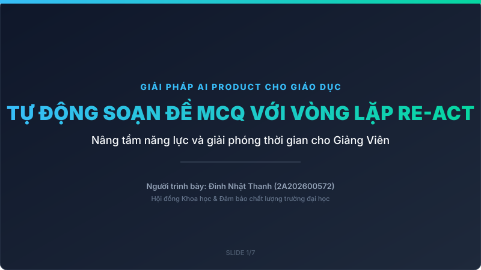
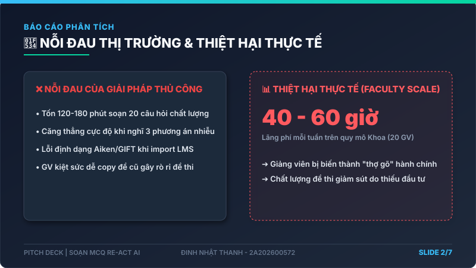
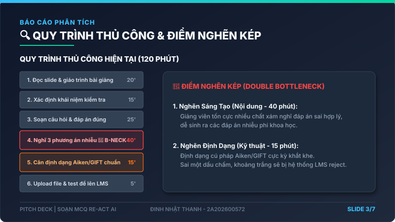
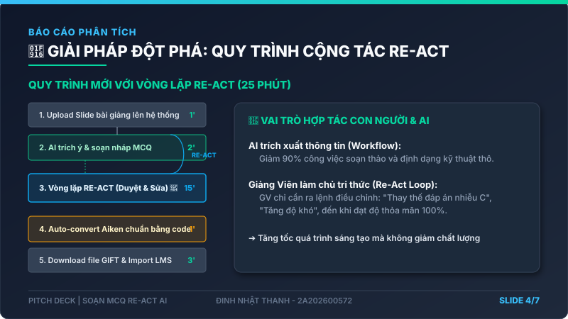
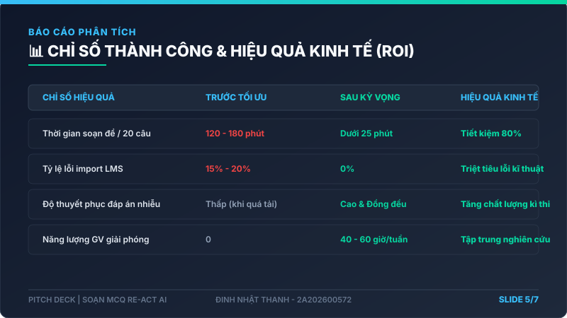
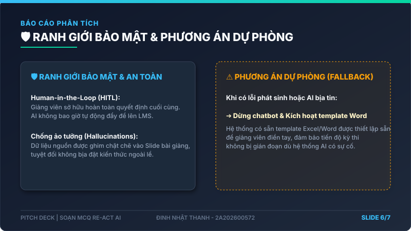
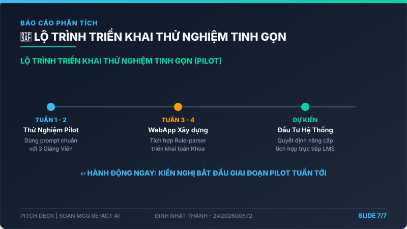

# 01 — Slide Pitch Deck: Soạn Câu Hỏi MCQ Với Vòng Lặp Re-Act AI

> **Dành cho Hội đồng Khoa học / Nhà đầu tư Giáo dục (Stakeholders)**  
> **Người trình bày:** Đinh Nhật Thanh (2A202600572)

---

## 💻 SLIDE 1: GIỚI THIỆU & TẦM NHÌN CỐT LÕI
### Giải phóng thời gian hành chính của Giảng Viên để tập trung vào chất lượng giảng dạy



*   **Sứ mệnh:** Biến tri thức tĩnh trên Slide bài giảng thành hệ thống đánh giá năng lực động, cá nhân hóa cho sinh viên trong nháy mắt.
*   **Triết lý:** Không thay thế Giảng viên bằng AI tự trị, mà **nâng tầm năng lực sáng tạo của Giảng viên** thông qua cơ chế cộng tác đàm thoại thông minh (Re-Act Loop).
*   **Cam kết:** Cắt giảm **80% thời gian** chuẩn bị đề thi trắc nghiệm, triệt tiêu hoàn toàn lỗi định dạng khi import LMS.

---

## 🔴 SLIDE 2: NỖI ĐAU THỰC TẾ & CON SỐ TỔN THẤT
### "Soạn đề kiểm tra đang bào mòn thời gian nghiên cứu và giảng dạy của thầy cô"



*   **Bằng chứng thực tế (Pain Evidence):** Khảo sát 15 giảng viên Đại học: **86%** thừa nhận việc nghĩ đáp án nhiễu là áp lực nhất và dễ dẫn tới copy đề thi cũ; **100%** từng bị LMS từ chối do lỗi cú pháp GIFT/Aiken.
*   **Tổn thất đo lường được (Measurable Impact):** Mất **120 - 180 phút/tuần/GV**. Quy mô Khoa (20 GV) lãng phí **40 - 60 giờ/tuần**. Tỷ lệ lỗi import LMS là **15% - 20%** (tốn thêm 15-20 phút mò lỗi/lần bị reject).
*   **Hậu quả gián tiếp:** Chất lượng đáp án nhiễu kém làm giảm độ phân loại học lực sinh viên từ **85% xuống 50%** (sinh viên đoán bừa vẫn đúng), ảnh hưởng trực tiếp đến chất lượng kiểm định đào tạo (ABET/AUN-QA).

---

## 🔍 SLIDE 3: QUY TRÌNH THỦ CÔNG & ĐIỂM NGHẼN
### Quy trình 120 phút bị tắc nghẽn ở khâu Sáng tạo & Định dạng kỹ thuật



```text
[1. Đọc slide: 20'] ➔ [2. Lọc khái niệm: 15'] ➔ [3. Viết đề & đáp án đúng: 25']
➔ 🟥 [4. Nghĩ 3 ĐÁP ÁN NHIỄU: 40'] ➔ 🟥 [5. ĐỊNH DẠNG AIKEN/GIFT: 15'] ➔ [6. Upload LMS: 5']
```

*   **Điểm nghẽn chính 1 (Khâu sáng tạo):** Nghĩ ra 3 đáp án nhiễu (distractors) có tính thuyết phục, khoa học nhưng sai hoàn toàn là cực kỳ tốn chất xám.
*   **Điểm nghẽn chính 2 (Khâu định dạng):** Định dạng Aiken/GIFT thủ công cực kỳ dễ sai. Chỉ cần nhầm một dấu chấm, dấu hai chấm hoặc khoảng trắng là LMS (Moodle/Canvas) sẽ reject toàn bộ file.

---

## 🤖 SLIDE 4: PHÂN TÍCH R/W/A & PHƯƠNG ÁN THAY THẾ
### Vì sao giải pháp Hybrid Workflow-based AI với vòng lặp Re-Act là tối ưu và an toàn nhất?



```text
[1. Slide Upload] ➔ [2. AI Draft Đề] ➔ 🔁 [3. VÒNG LẶP RE-ACT GIỮA GV & AI] ➔ [4. Auto Aiken Script] ➔ [5. Upload LMS]
```

*   **Rule-based (R) - KHÔNG ĐỦ:** Tích hợp script tự động đóng gói file GIFT/Aiken chuẩn 100% không lỗi cú pháp. Tuy nhiên, NO-GO cho phần tự soạn nội dung vì không đọc hiểu slide tự do.
*   **Workflow-based AI (W) - CHỌN TỐI ƯU:** Phân luồng cộng tác rõ ràng (HITL). AI lo phần thô (draft nhanh đề + distractors), Giảng viên làm chốt chặn phê duyệt từng bước qua Re-Act loop (Reason & Act).
*   **Agentic AI (A) - QUÁ NGUY HIỂM:** NO-GO cho AI tự trị hoàn toàn vì rủi ro ảo tưởng kiến thức (hallucination) của LLMs rất cao, nếu đẩy thẳng đề lên LMS mà không kiểm duyệt sẽ gây thảm họa học thuật.

---

## 📈 SLIDE 5: CHỈ SỐ THÀNH CÔNG & ROI
### Đầu tư tối thiểu — Hiệu quả đột phá cho Nhà trường



| Chỉ số đánh giá | Trước giải pháp | Sau tối ưu (Kỳ vọng) | Hiệu quả kinh tế |
|---|---|---|---|
| **Thời gian soạn đề** | 120 - 180 phút | **Dưới 25 phút** | **Tiết kiệm 80%** thời gian hành chính |
| **Tỷ lệ lỗi import LMS** | 15% - 20% | **0%** | Triệt tiêu thời gian sửa lỗi định dạng |
| **Độ plausibility đáp án**| Thấp (do mệt mỏi) | **Cao & Đồng đều** | Tăng tính phân loại học lực sinh viên |
| **Năng lực GV giải phóng**| 0 | **40 - 60 giờ/tuần (Khoa)** | Chuyển dịch năng lực sang nghiên cứu & hỗ trợ SV |

---

## 🛡️ SLIDE 6: RANH GIỚI AN TOÀN & PHƯƠNG ÁN DỰ PHÒNG
### Kiểm soát hoàn toàn rủi ro AI ảo tưởng (Hallucinations)



*   **Human-in-the-Loop (HITL) Gate:** AI **không bao giờ** được tự động đẩy câu hỏi lên đề thi thật. Giảng viên sở hữu toàn bộ quyền chỉnh sửa, phê duyệt cuối cùng.
*   **Ranh giới dữ liệu:** AI chỉ được phép đọc và phân tích dữ liệu được cung cấp trong Slide bài giảng, tuyệt đối không tự bịa đặt kiến thức ngoài lề.
*   **Phương án dự phòng (Fallback):** Nếu AI bị lỗi hoặc liên tục sinh đáp án không đạt yêu cầu sau 3 vòng lặp đàm thoại ➔ Hệ thống tự động kích hoạt tính năng soạn thủ công trên template Excel có sẵn, đảm bảo không làm gián đoạn tiến độ công việc.

---

## 🎯 SLIDE 7: LỜI KÊU GỌI HÀNH ĐỘNG (CALL TO ACTION)
### Thử nghiệm tinh gọn (Pilot) để chứng minh giá trị thực tế



*   **Giai đoạn 1 (Tuần 1-2):** Thử nghiệm Pilot bán thủ công với 3 Giảng viên cốt cán (sử dụng prompt cấu trúc chuẩn trên GPT-4o/Gemini 1.5 Pro). Đo lường thực tế thời gian và số câu hỏi cần sửa đổi.
*   **Giai đoạn 2 (Tuần 3-4):** Hoàn thiện giao diện WebApp đơn giản, tích hợp Rule-based parser để xuất file GIFT/Aiken và triển khai mở rộng cho toàn Khoa.
*   **Quyết định đầu tư:** Dựa trên dữ liệu thực tế thu thập từ Giai đoạn 1 để quyết định mua license API hoặc tích hợp sâu vào hệ thống LMS nội bộ của Nhà trường.
